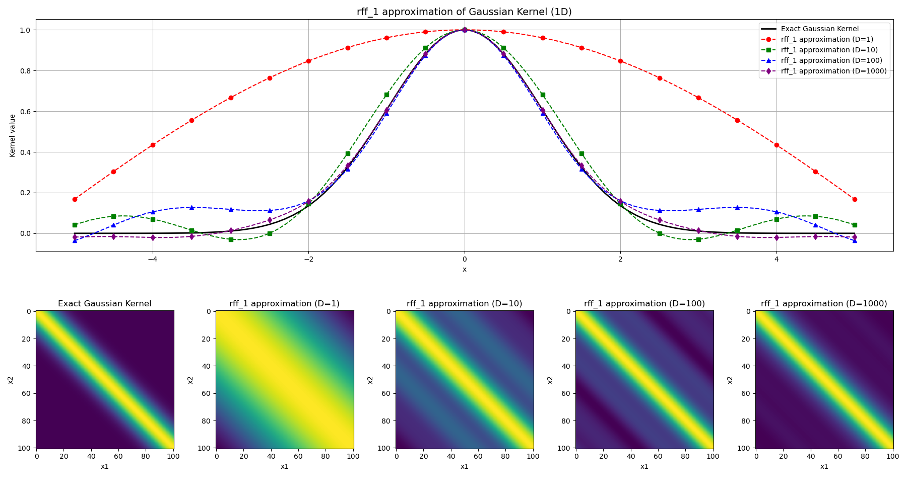
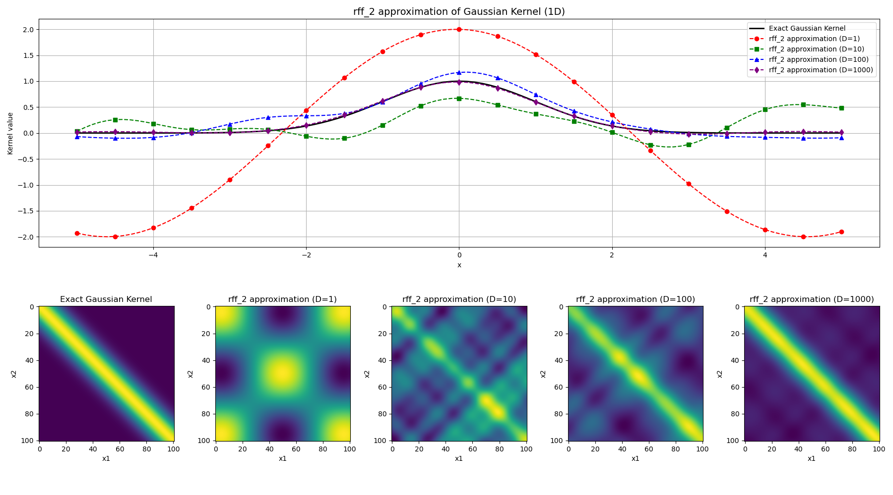
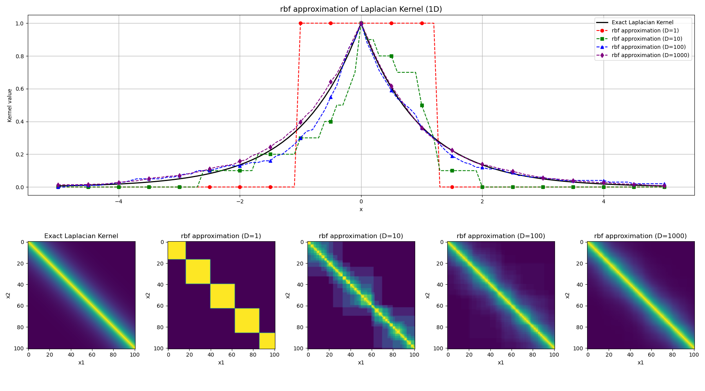

# Random Features

### Gaussian kernel approximated by the first random fourier feature:

### Gaussian kernel approximated by the second random fourier feature:

### Laplacian kernel approximated by the random binning feature introduced in the paper:
